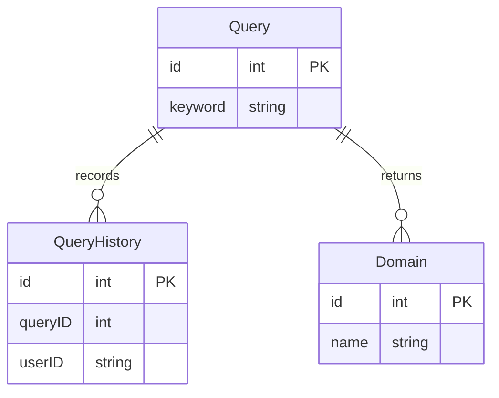

# ERD

```mermaid
erDiagram
    Query {
      id int PK
      keyword string
    }
    QueryHistory {
        id int PK
        queryID int
        userID string
    }
    Domain {
      id int PK
      name string
    }

    Query ||--o{ QueryHistory : records
    Query ||--o{ Domain : returns
    
```