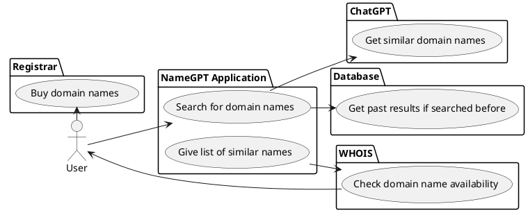

# Usecase

```plantuml
@startuml
!pragma layout smetana
left to right direction
actor User
package "NameGPT Application" {
    usecase "Search for domain names" as Search 
    usecase "Give list of similar names" as Result
}

package WHOIS {
    usecase "Check domain name availability" as Check
}

package ChatGPT {
    usecase "Get similar domain names" as Recommend
}

package Database {
    usecase "Get past results if searched before" as Cache
}

package Registrar {
    usecase "Buy domain names" as Buy
}

User --> Search
User -> Buy
Result --> Check
Check -> User
Search --> Cache
Search --> Recommend
@enduml
```